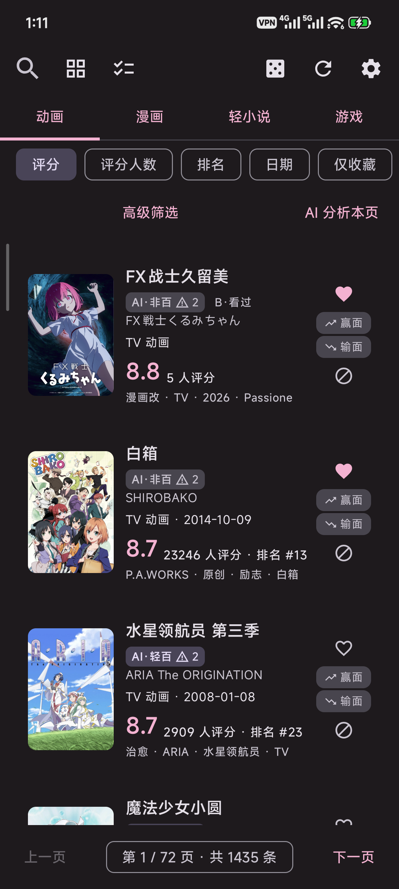
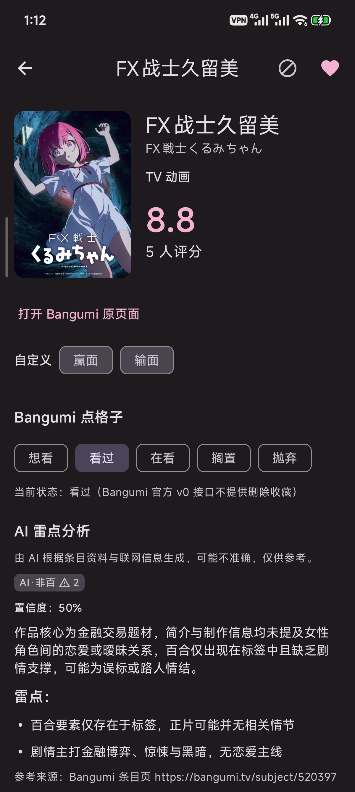
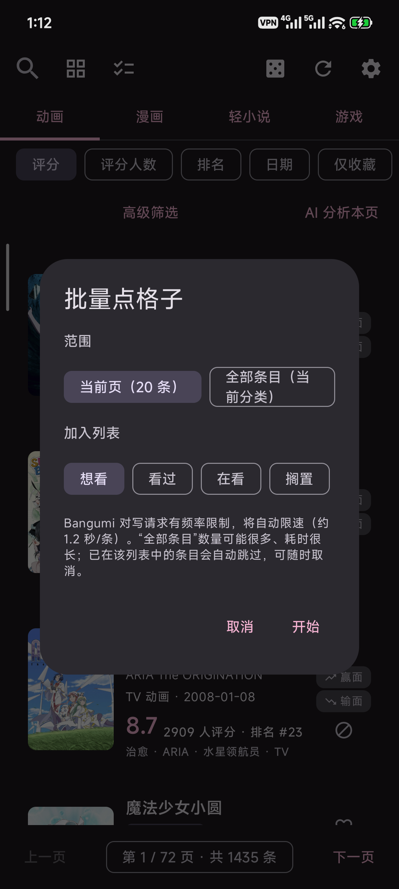
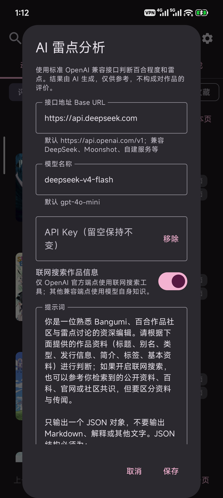
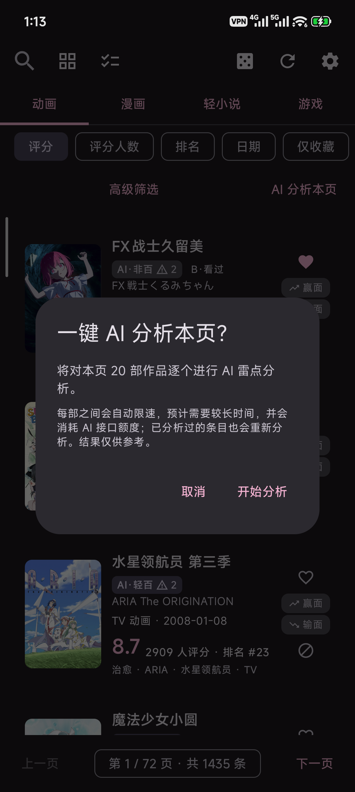

# yuri1st

一个面向百合作品读者的 Android 应用：用 Bangumi v0 API 整理带有精确 `百合` / `轻百合` 标签的动画、漫画、轻小说和游戏，提供本地目录、AI 雷点分析、Bangumi 点格子等特色功能。应用不读取评论、日志、讨论或吐槽。

## 特色功能

- **本地百合目录**：按动画 / 漫画 / 轻小说 / 游戏分类同步与浏览，内置基础条目可离线使用
- **AI 雷点分析**：标准 OpenAI 兼容接口（OpenAI、DeepSeek、Moonshot、自建端点等），读取作品资料并可选联网检索，输出真百 / 轻百 / 非百、置信度、理由与雷点列表；提示词可自由编辑，结果标注“仅供参考”
- **Bangumi 点格子**：把想看 / 看过 / 在看 / 搁置 / 抛弃写入你的 Bangumi 账号；支持单条与批量（当前页或全部分类），自动限速规避频率限制
- **赢面 / 输面标记**：为每个条目打上你自己的自定义标签，并按此筛选
- **列表 / 封面双视图**：封面模式每行两个封面；信息流针对高刷新率屏幕做了性能优化，Release 构建滚动掉帧率实测接近 0
- **隐私友好**：Bangumi Token 与 AI API Key 均用 Android Keystore 加密保存；不收集账号密码，不读取评论区

## 界面预览

| 信息流（AI 徽章 / 赢面 / 输面） | 详情页：Bangumi 点格子 + AI 雷点分析 |
| --- | --- |
|  |  |

| 一键批量点格子 | AI 分析设置 | 一键本页 AI 分析 |
| --- | --- | --- |
|  |  |  |

### AI 雷点分析（重点）

详情页点击“开始 AI 分析”后，应用会重新读取该条目的 Bangumi 资料，再调用你配置的 OpenAI 兼容接口（支持联网搜索），返回：

- 判断结论：真百 / 轻百 / 非百，并附置信度
- 判断理由与雷点列表（如后宫/党争、开放式结局、官方否认百合等）
- 参考来源，以及“仅供参考”的明确提示

结果按条目缓存到本地，列表和封面视图会直接显示 AI 徽章（如 `AI·轻百 ⚠3`）；高级筛选里可以按真百 / 轻百 / 非百过滤。“AI 分析本页”按钮支持一次分析当前页全部作品，实时显示进度并可取消。

### Bangumi 点格子（重点）

在详情页把状态写入你的 Bangumi 账号收藏：想看 / 看过 / 在看 / 搁置 / 抛弃。写入后列表与封面视图会显示状态徽章（如 `B·看过`）。左上角清单图标支持批量点格子：

- 范围可选“当前页”或“当前分类全部条目”
- 自动跳过已在该列表中的条目
- 按约 1.2 秒/条限速写入，避免触发 Bangumi 频率限制
- 实时显示进度，可随时取消

## 当前能力

- 动画（Bangumi type 2）、漫画（type 1 + `漫画` 元标签）、轻小说（type 1 + `小说` 元标签）和游戏（type 4）分开同步、浏览
- 合并 `百合`、`轻百合` 两次标签查询，并对接口结果再次执行对应标签的精确校验
- Room 本地缓存，启动时先展示缓存
- 按评分、评分人数、排名、日期排序
- 信息流支持列表 / 封面双视图切换：封面模式每行两个封面，标题与评分以小字显示在封面下方
- 本地多字段搜索由左上角搜索按钮打开：日文名、中文名、英文名、平台、标签、原作/Staff 等基本资料，以及年份和最低评分人数过滤；也支持粘贴 bgm.tv / bangumi.tv 条目链接或纯 ID 在线导入
- 高级筛选默认折叠，界面保持简洁
- 本地目录固定每页 20 条，通过上一页/下一页浏览，不使用无限下拉
- 条目详情、1～10 分分布、收藏统计、简介和基本资料
- 条目详情可跳转到对应的 Bangumi 官方原页面
- 本地收藏，不需要 Bangumi 登录或 Access Token
- 按最低评分随机推荐 5 个动画/漫画/轻小说/游戏条目
- 条目屏蔽与屏蔽管理：屏蔽前有确认提示，列表和随机推荐都会排除屏蔽条目，可在“设置→屏蔽管理”中解除
- NSFW 默认关闭，可在“设置”中直接打开或关闭；关闭时本地缓存也会过滤，开启后可用“仅 NSFW”快速筛选单独查看
- 网络代理可选“跟随系统 / HTTP / SOCKS”，API 与封面图片共用同一代理路由
- 外观支持跟随系统 / 浅色 / 夜间三种模式，设置中可随时切换
- 可选粘贴 Bangumi 官方 Access Token，以 Bearer Header 访问需要授权的敏感内容；不收账号密码
- 首次建库显示逐页进度；普通刷新只累加新条目，设置中可强制重新拉取并更新已有条目
- 四个分类并行拉取、12 小时自动刷新窗口、分页请求间隔和常见网络错误提示
- 内置 159 条基础条目（数据更新于 2026-08-10），首次打开即可离线浏览；首启提示停留 3 秒且只显示一次
- 超长标签分区按年份分片同步，进度和完成提示会标明年份区间
- 关于页包含版本、设计署名、开源说明和百合相关友链（S1 百综楼 12.0、S1 动漫论坛、百合会）
- Bangumi 点格子（高级功能）：在条目详情页把“想看 / 看过 / 在看 / 搁置 / 抛弃”写入你的 Bangumi 账号收藏，列表与封面视图会显示最近一次同步到的状态徽章；需要已配置的 Access Token
- AI 雷点分析（高级功能）：使用标准 OpenAI 兼容接口（默认 OpenAI，也支持 DeepSeek、Moonshot、自建端点等）读取作品资料并联网检索，输出真百 / 轻百 / 非百判断、置信度、理由与雷点列表；详情页完整展示，列表与封面视图显示缓存结果徽章，结果一律标注“仅供参考”
- AI 配置可编辑：接口地址、模型、API Key（Android Keystore 加密保存）与提示词均可修改，内置默认提示词，可随时“恢复默认提示词”
- 一键本页 AI 分析（高级筛选右侧）：确认后对当前页全部作品逐个分析并限速，实时显示进度，可随时取消；分析结果立即缓存并在列表/封面显示徽章
- 高级筛选新增“分类”：可只保留 TV 动画 / OVA / 剧场版 / 其他
- 高级筛选新增“AI/自定义”：可按 AI 判断的真百 / 轻百 / 非百筛选，也可按自定义的赢面 / 输面筛选
- 随机、收藏、屏蔽改为图标按钮；列表卡片右侧在收藏/屏蔽正下方竖向排列“赢面 / 输面”按钮，选中时填充高亮色并加粗边框，点击可设置或取消
- 搜索框输入文字后，搜索/导入按钮会变为高亮实心按钮，未输入时保持灰色
- 一键批量点格子（左上角清单图标）：可选手“当前页”或“当前分类全部条目”、选择要加入的收藏列表（想看/看过/在看/搁置/抛弃）；自动跳过已在目标列表的条目，并按约 1.2 秒/条限速写入，避免触发 Bangumi 频率限制，可随时取消
- 页面状态持久化：当前分类、搜索词、排序、筛选、页数、视图模式和打开的详情页会写入本地，进程被系统回收后重新进入应用会恢复到原位置

## 数据流程

1. `POST /v0/search/subjects` 分别查询动画、漫画、轻小说和游戏，并将 `tag: ["百合"]` 与 `tag: ["轻百合"]` 两组结果去重合并；漫画额外要求 `meta_tags: ["漫画"]`，轻小说额外要求官方实际使用的 `meta_tags: ["小说"]`。
2. NSFW 关闭时所有请求使用不带 Token 的官方公开 API，并显式发送 `nsfw: false`；开启时所有请求统一携带用户的 Access Token，再分别请求 `false` 与 `true` 两组并去重合并，因为官方 schema 中 `true` 表示“仅 R18”。
3. 客户端只接收响应标签中确实含有本次请求的精确标签且满足目录元标签的条目。
4. 首次同步逐页建立 Room 目录；后续普通刷新只写入本地没有的条目，不覆盖已有远端资料。
5. “设置”→“强制重新拉取数据库”会重新写入全部命中条目。只有强制同步且该分类、标签和 NSFW 分区完整翻页时，才会把不再属于远端结果的旧缓存移出目录；本地行和收藏仍保留。
6. 打开详情时调用 `GET /v0/subjects/{id}` 补全当前条目资料；UI 始终观察 Room，因此建库过程中可以逐步看到结果，离线时也能查阅上次同步内容。
7. 打开详情时若已配置 Access Token，会调用 `GET /v0/me` 缓存用户名，再读取 `GET /v0/users/{username}/collections/{subject_id}` 同步你的点格子状态；在详情页点击状态时通过 `POST /v0/users/-/collections/{subject_id}` 写入（该接口按官方文档“不存在则创建，存在则修改”）。
8. AI 分析仅由用户在详情页主动触发：先重新读取条目资料，再请求配置的兼容端点。OpenAI 官方端点使用 `/responses` + `web_search` 工具联网搜索；其他兼容端点使用 `/chat/completions`，依赖模型自身知识（若服务商自带联网能力则同样生效）。结果以 JSON 解析后写入 Room 并按条目缓存。

Bangumi 把条目搜索标为实验性 API。网络层、DTO 和仓库层已分开，后续接口变化不会直接侵入 UI。

## 代理设置

主页右上角点击“设置”：

- `跟随系统`：使用 Android 系统代理或 VPN，推荐优先选择。
- `HTTP`：适合 Clash、sing-box 等提供的 HTTP 监听端口，常见示例为 `127.0.0.1:7890`。
- `SOCKS`：使用 SOCKS 监听端口；地址会以 unresolved socket 交给代理，避免目标域名先在本地解析。

切换后会取消旧连接并自动刷新。应用不会关闭 HTTPS 证书或主机名校验，也没有照搬同类客户端中的 MITM/ECH/Worker 代理代码。当前不保存代理用户名和密码。

## 可选 Bangumi 授权

“设置”→“Bangumi Access Token”可打开 Bangumi 官方 Token 页面。用户自行在浏览器登录并生成 Token，再粘贴回 App；App 不提供账号密码登录表单。NSFW 关闭时所有条目及详情请求都不带 Token；NSFW 开启时所有 Bangumi API 请求统一附加 `Authorization: Bearer ...`。Token 使用 Android Keystore 中的 AES-GCM 密钥加密保存，不会写入日志或备份。

官方 OAuth 2.0 授权码流程需要 `client_id` 与 `client_secret`；Android APK 无法安全保管 `client_secret`，且官方文档未说明 PKCE，因此本原型不内置该流程。若将来有可信后端，可由后端交换授权码并支持 refresh token。

## 开发者标识（Bangumi User-Agent）

Bangumi 官方要求 API 请求携带可联系的 User-Agent，格式为：

```text
应用名/版本 (开发者标识; 项目主页)
```

“开发者标识”不需要向 Bangumi 提交申请材料，建议直接使用你的 **bgm.tv 用户名**（如 `yuri1st/0.3.0 (sai; https://github.com/you/yuri1st)`）。如果你还需要注册第三方 OAuth 应用（获取 `client_id` 等），可在 [bgm.tv/dev/app](https://bgm.tv/dev/app) 创建；本应用只使用个人 Access Token，不依赖 OAuth `client_secret`。

Debug 构建内置开发版 User-Agent，可直接使用公开 API；Release 构建强制要求通过 Gradle 属性或环境变量提供正式标识，缺少时会主动失败：

```bash
BANGUMI_USER_AGENT='yuri1st/0.3.0 (你的bgm用户名; https://github.com/toydream525/yuri1st)' \
  ./gradlew assembleRelease
```

正式发布前请把占位主页替换为真实的公开仓库地址，方便 Bangumi 与用户联系到你。

## AI 雷点分析（高级功能）

在“设置 → 高级功能 → AI 雷点分析”中配置：

- `接口地址`：默认 `https://api.openai.com/v1`，兼容 OpenAI 官方及其他标准 `chat/completions` 服务商（DeepSeek、Moonshot、Ollama 网关、自建服务等）。
- `API Key`：只保存在 Android Keystore 中，不写入日志或备份；留空保存表示保持不变，也可一键移除。
- `模型名称`：默认 `gpt-4o-mini`，可按服务商填写。
- `联网搜索`：仅 OpenAI 官方端点启用 `web_search` 工具；其他端点关闭该开关仍可正常分析，但搜索依赖服务商自身能力。
- `提示词`：内置默认提示词，要求模型只输出 JSON，并写明真百 / 轻百 / 非百的判定规则、雷点列举规则和低置信度约束；可自由编辑或一键恢复默认。

点击详情页“开始 AI 分析”后，应用会先读取该条目的 Bangumi 资料（标题、别名、类型、简介、标签、基本资料、评分等），再调用模型。结果按条目缓存，列表和封面视图只显示缓存中的徽章；AI 判断可能存在错误或争议，界面会明确标注“仅供参考”。

## 开发环境

- Android Studio
- JDK 17
- Android SDK 35
- Gradle 8.11.1（项目 Wrapper 会自动下载）

调试构建内置开发版 User-Agent，可以直接使用公开 API；制作发布包前，请通过 Gradle 属性或环境变量提供带真实开发者 ID/项目主页的正式 User-Agent。缺少该值时发布构建会主动失败：

```bash
./gradlew test
./gradlew assembleDebug
BANGUMI_USER_AGENT='yuri1st/0.3.0 (developer-id; https://example.com/yuri1st)' \
  ./gradlew assembleRelease
```

也可以单独验证 Bangumi 是否接受空关键词的标签查询：

```bash
BANGUMI_USER_AGENT='yuri1st/0.3.0 (developer-id; https://example.com/yuri1st)' \
  python3 scripts/probe_bangumi.py --category anime
```

如果接口返回 HTTP 400/422，App 会明确提示“仅标签查询需要调整”，不会悄悄退化成可能漏条目的关键词搜索。

## 开源与许可证

- 源码仓库：[github.com/toydream525/yuri1st](https://github.com/toydream525/yuri1st)
- 许可证：本项目采用 [MIT 许可证](LICENSE)。
- 第三方组件：见 [第三方组件清单](THIRD_PARTY_NOTICES.md)。
- 条目数据来自 Bangumi 公开接口，数据版权归 Bangumi 及各条目权利方所有。

## 已知边界

- `百合`、`轻百合` 是 Bangumi 用户标签，应用只做精确收录，不保证标签的内容判断完全准确。
- Bangumi 文档说明无相应权限时会忽略 NSFW 包含选项，因此开关表示“请求并允许展示”，不保证匿名 API 会返回全部 NSFW 条目。
- 实测官方搜索会把请求页大小限制为 20，并将部分标签查询的可分页总数封顶在 1000。达到该上限、分页元数据异常或 API 忽略 NSFW 分区时，界面会提示部分结果；强制同步不会对账该分区旧缓存，也不会把本轮记为完整同步。
- 当前同步为前台触发与启动时过期检查；周期后台同步可在后续加入 WorkManager。
- 点格子写入依赖 Bangumi 官方 v0 接口：`POST` 按文档“不存在则创建，存在则修改”，只支持五种状态，官方未提供删除收藏的端点，因此本应用不提供“取消收藏”。
- 点格子状态在打开详情页时同步一次并缓存在本地；在网页端修改后，需要再次打开详情页才会刷新。
- AI 判断是模型生成内容，可能出错或带有模型偏见；即使开启联网搜索，也不代表获得完整或准确的社区共识，请以作品本身和可信来源为准。
- 当前未实现带用户名/密码的代理认证；需要认证代理时应后续使用仅内存凭据或 Android Keystore，而不是明文偏好设置。
- 发布前需要补充隐私说明和正式 User-Agent 联系方式。
